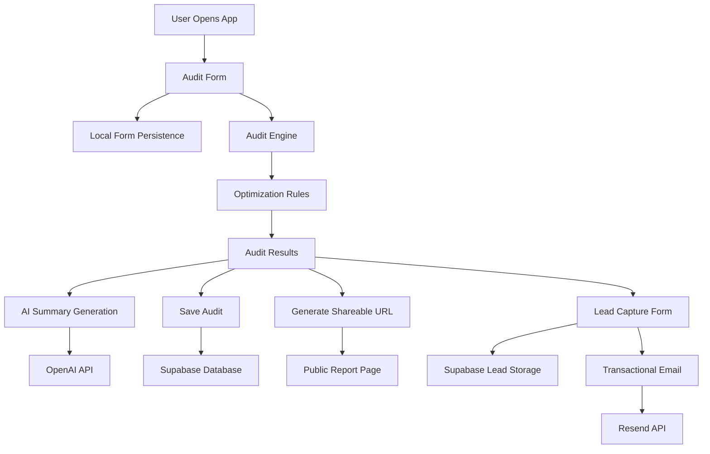

# Architecture

## System Overview

SpendItWise is a React-based AI spend audit platform that helps startups optimize spending across AI subscriptions and API providers.

The application follows a client-first architecture with Supabase as the backend service layer.

---

# System Diagram

---

# Data Flow

## 1. User Input

Users enter:
- AI tools
- subscription plans
- monthly spend
- number of seats
- team size
- primary use case

The form state is automatically persisted using localStorage to prevent accidental data loss during refreshes.

---

## 2. Audit Engine

After submission, the application runs a rule-based audit engine.

Each tool is evaluated for:
- plan mismatch
- unnecessary enterprise usage
- cheaper equivalent plans
- cheaper alternative vendors
- potential savings through AI credits

The engine calculates:
- optimized monthly spend
- monthly savings
- annual savings
- recommendation reasoning

The audit logic is deterministic instead of AI-generated to ensure transparency and financial reliability.

---

## 3. Results Generation

The results page displays:
- per-tool recommendations
- savings breakdown
- optimization reasoning
- total monthly savings
- total annual savings

For high-savings audits, Credex consultation messaging is surfaced prominently.

---

## 4. AI Summary Layer

Once the audit is completed:
- the audit result is sent to an AI summarization endpoint
- OpenAI generates a personalized ~100-word summary

If the API fails:
- the app falls back to a templated summary
- the user experience remains uninterrupted

---

## 5. Backend Storage

Audit data is stored in Supabase.

Stored entities include:
- audit results
- generated summaries
- lead capture data

Sensitive information such as company name and email is excluded from public shareable reports.

---

## 6. Shareable Reports

Each audit generates:
- a unique public URL
- a sanitized public-facing report

This enables:
- social sharing
- viral growth
- team collaboration

---

## 7. Email Flow

After lead capture:
- user data is submitted to Supabase
- a transactional confirmation email is sent using Resend

The email confirms:
- audit completion
- savings opportunity
- potential Credex follow-up

---

# Frontend Stack

- React
- Vite
- React Router
- CSS
- Context API

---

# Backend & Infrastructure

- Supabase
- Supabase Edge Functions
- Resend
- OpenAI API

---

# Why This Stack

## React + Vite

Chosen for:
- rapid iteration speed
- component reusability
- excellent developer experience
- fast local development

---

## Supabase

Chosen because it provides:
- hosted Postgres
- authentication-ready infrastructure
- serverless edge functions
- easy API integration

This significantly reduced backend setup time.

---

## Rule-Based Audit Engine

A deterministic rules engine was intentionally used instead of AI-generated financial recommendations.

Reason:
- financial recommendations require predictability
- calculations should remain explainable
- debugging is easier
- recommendations remain auditable

AI was only used where creativity/personalization added value.

---

# Scaling Considerations (10k Audits/Day)

If the product needed to scale significantly, I would:

## 1. Move Audit Logic Server-Side
Currently the audit engine runs primarily on the client.

At scale:
- logic would move to dedicated backend services
- calculations could be cached
- sensitive business rules could remain private

---

## 2. Queue AI Summary Generation

AI summary requests would move into:
- async job queues
- background workers

This would:
- reduce API bottlenecks
- improve page responsiveness
- reduce failure rates during spikes

---

## 3. Add Rate Limiting

Production abuse prevention would include:
- IP rate limiting
- request throttling
- bot protection

---

## 4. CDN + Edge Caching

Public reports would be cached aggressively to reduce database load and improve global response times.

---

## 5. Analytics + Monitoring

Production monitoring would include:
- error tracking
- audit completion funnels
- API latency monitoring
- conversion analytics