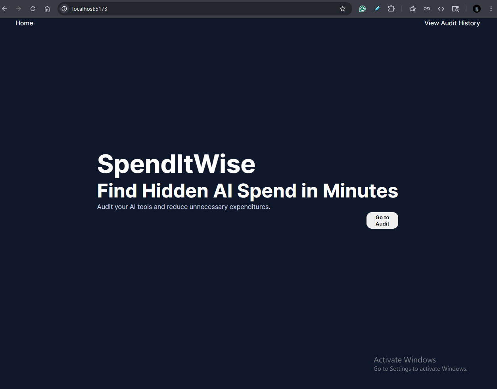
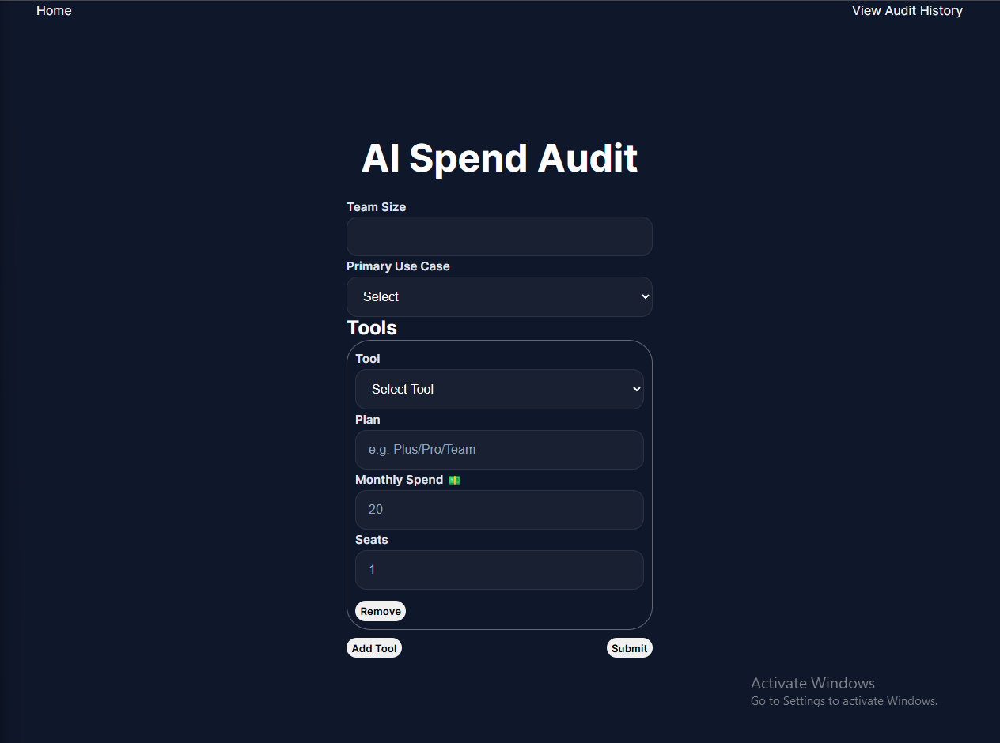
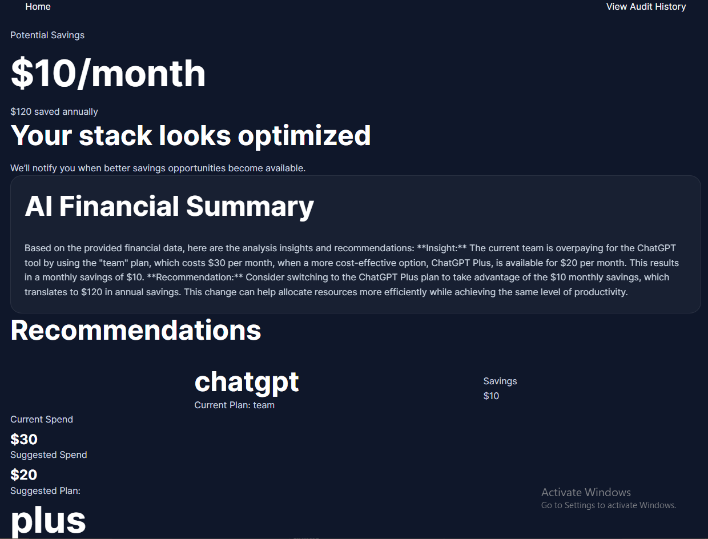
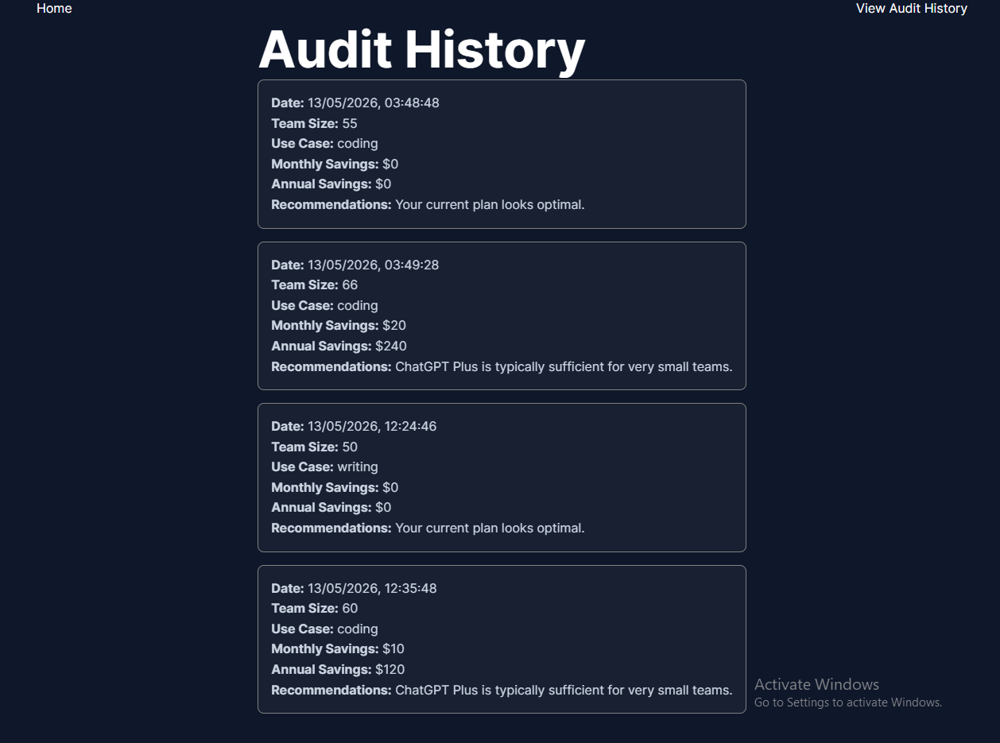

# SpendItWise

SpendItWise is an AI spend audit platform that helps startups and teams identify overspending across AI tools like ChatGPT, Claude, Cursor, Copilot, Gemini, and API providers. Users receive instant optimization recommendations, estimated monthly savings, AI-generated summaries, and shareable audit reports.

Built as part of the Credex Web Development Intern Assignment 2026.

---

## Live Demo

Deployed URL: https://spenditwisee.netlify.app/
GitHub repo: https://github.com/SaloniK058/spend-it-wise

---

## Screenshots

### Homepage


### Audit Form


### Shareable Report & Audit Result


### Audit History

---

## Features

- Multi-tool AI spend audit
- Intelligent optimization recommendations
- Monthly + annual savings calculations
- AI-generated personalized summaries
- Shareable public audit URLs
- Email capture + transactional emails
- Supabase backend integration
- Persistent form state using localStorage
- Responsive UI
- Automated tests + CI pipeline

---

## Tech Stack

### Frontend
- React
- Vite
- React Router
- CSS

### Backend / Services
- Supabase
- Resend
- OpenAI API

### Tooling
- ESLint
- Vitest
- GitHub Actions

---

## Local Setup

Clone the repository:

```bash
git clone https://github.com/SaloniK058/spend-it-wise
```

Install dependencies:

```bash
npm install
```

Run locally:

```bash
npm run dev
```

Run tests:

```bash
npm run test
```

Run lint:

```bash
npm run lint
```

---

## Architecture Overview

1. User submits AI tool spending details
2. Audit engine evaluates optimization opportunities
3. Savings recommendations are generated
4. Results are displayed instantly
5. Audit data is stored in Supabase
6. AI summary is generated using OpenAI
7. Public shareable audit URL is created
8. Lead capture email is sent through Resend

---

## Key Decisions & Tradeoffs

### 1. Rule-based audit engine instead of AI-only recommendations
I used deterministic rule logic for financial recommendations to ensure transparency and reliability. AI was reserved only for personalized summaries.

### 2. Supabase for backend infrastructure
Supabase allowed fast setup for authentication-free storage, APIs, and edge functions while reducing backend complexity.

### 3. localStorage persistence for UX
Form data persists across refreshes to improve completion rate and reduce user frustration.

### 4. Public shareable audit URLs
Making reports shareable increases virality and aligns with the assignment’s distribution-focused goals.

### 5. Graceful AI fallback summaries
If the AI API fails, the app falls back to a templated summary to maintain reliability.

---

## Future Improvements

- PDF export
- Benchmarking against industry averages
- Team collaboration features
- Referral system
- Advanced analytics dashboard

---

## CI/CD

GitHub Actions automatically runs:
- ESLint
- Automated tests

on every push to `main`.

---

## License

This project was built for the Credex Web Development Intern Assignment 2026.